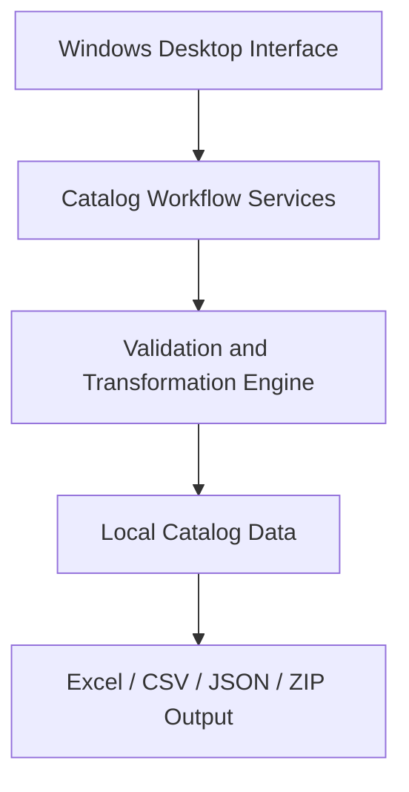
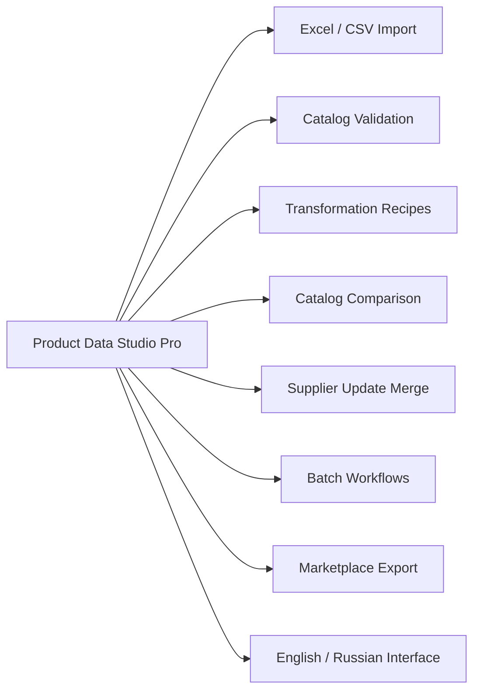
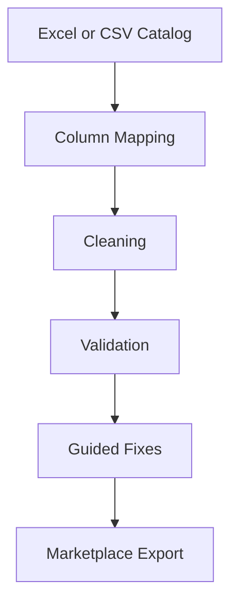
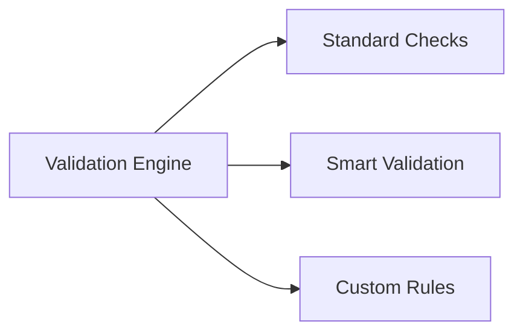
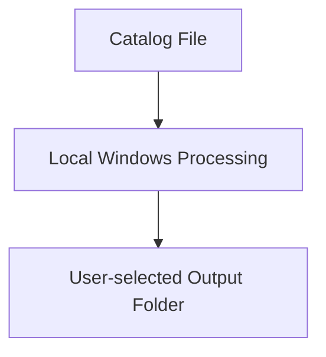
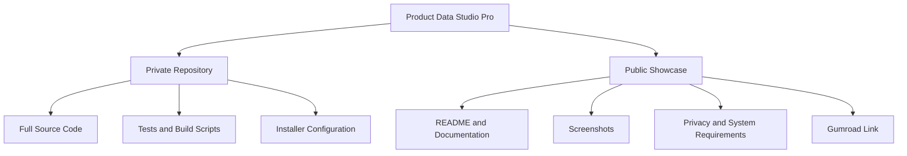

# Architecture Overview

Product Data Studio Pro is a Windows desktop application for preparing
e-commerce product catalogs.

> This document contains a high-level public architecture only. The complete
> implementation remains in a private repository.

## High-level architecture

## Main product components

## Catalog workflow

## Validation model

The application can detect missing product data, duplicate SKUs, invalid prices,
invalid image URLs, suspicious values, and values copied into the wrong columns.

## Batch processing

## Local-first processing

Catalog files are processed on the user's Windows computer. The application does
not require catalog data to be uploaded to an external service.

## Windows distribution

Customers do not need Python or PyCharm.

## Technology

- Python
- PySide6
- pandas
- openpyxl
- PyInstaller
- Inno Setup

## Repository separation

The public showcase does not contain source code, EXE files, or paid customer
downloads.
