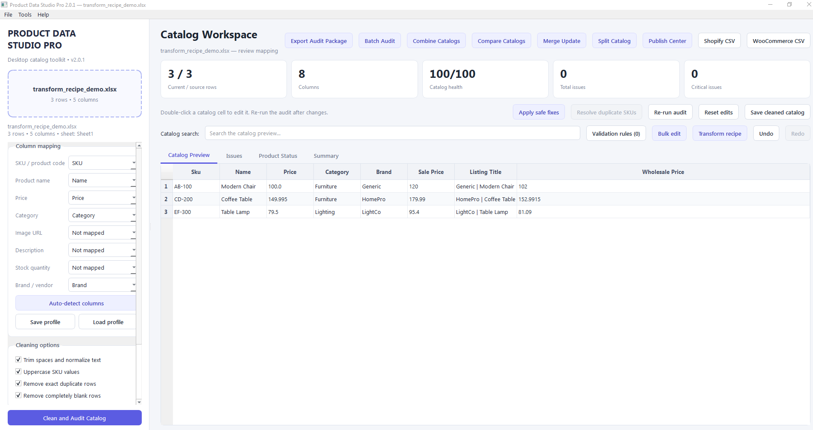
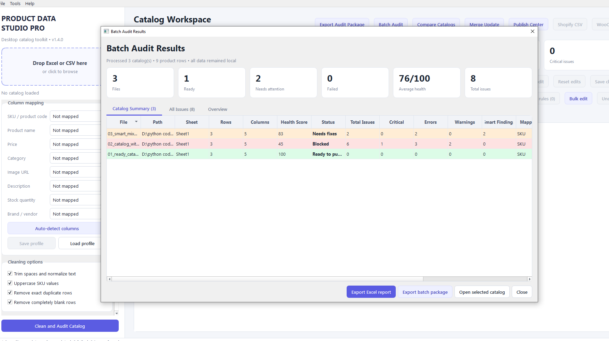
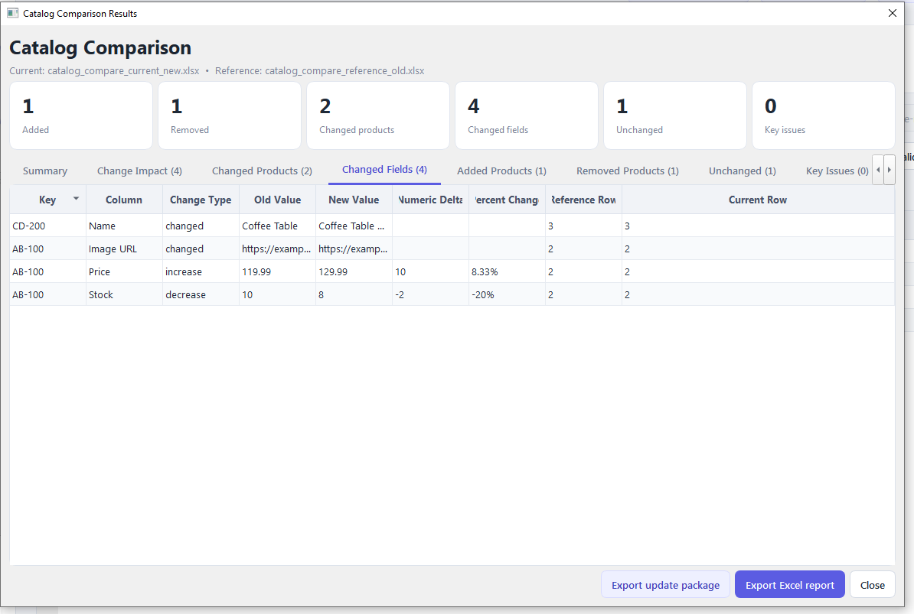
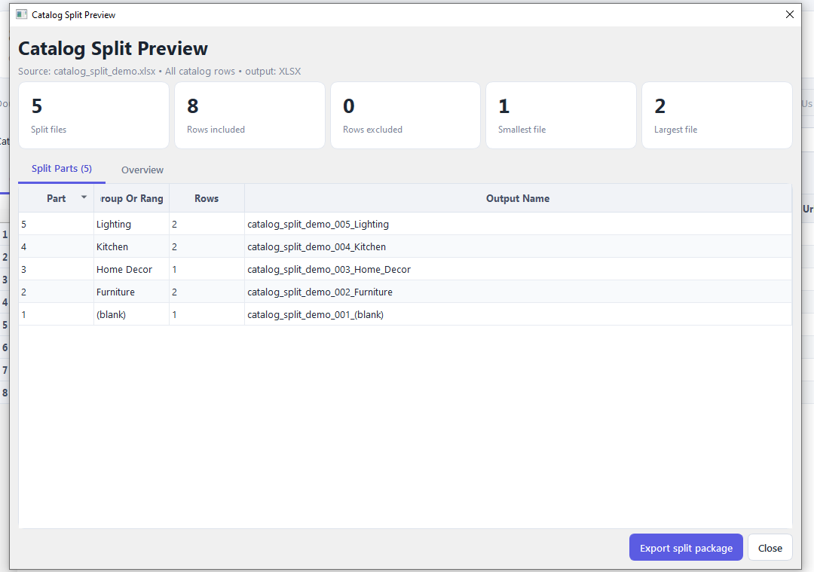
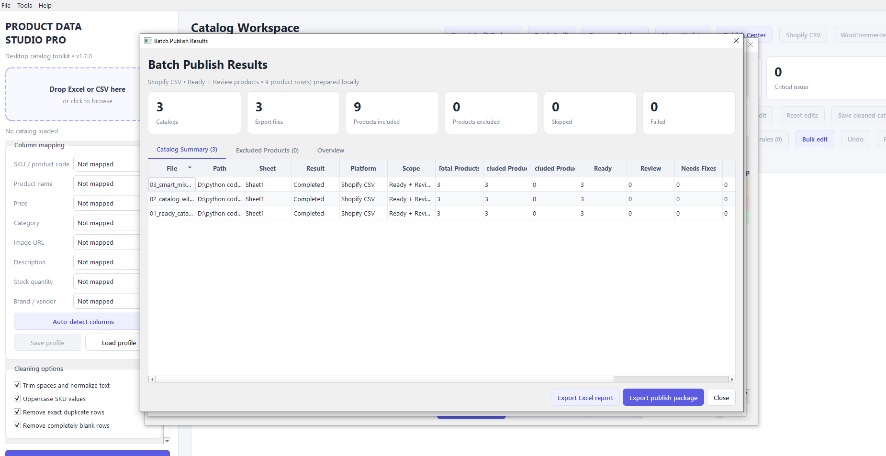
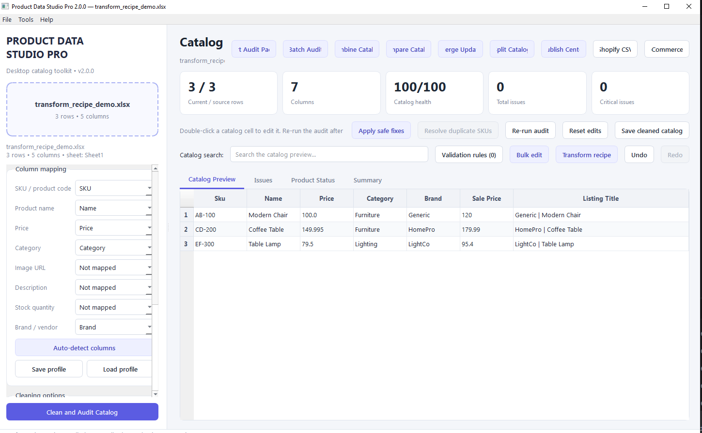

# Product Data Studio Pro

**Windows desktop software for cleaning, validating, transforming, comparing, merging, splitting, combining, and publishing e-commerce product catalogs.**

> Current commercial release: **2.2.0**  
> Interface languages: **English and Russian**

This is the **public showcase repository**. Product Data Studio Pro is proprietary commercial software, and its complete source code is maintained in a private repository.

## What Product Data Studio Pro does

The application helps e-commerce teams prepare Excel and CSV product catalogs without uploading business data to external services.

### Main capabilities

- Import Excel and CSV catalogs
- Automatic and manual column mapping
- Catalog cleaning and health scoring
- Duplicate SKU detection and guided resolution
- Smart validation for suspicious values and column mix-ups
- Reusable custom validation rules
- Guided issue fixing, bulk editing, Undo and Redo
- Reusable transformation recipes
- Old/new catalog comparison with price and stock deltas
- Supplier update merge with blank-overwrite protection
- Batch Audit, Batch Repair, Batch Review, and Batch Publish
- Catalog Splitter and Catalog Combiner
- Shopify and WooCommerce CSV export
- Styled Excel reports and ZIP delivery packages
- English and Russian interface
- Local processing with no telemetry or catalog upload

## Version 2.2.0

Version 2.2.0 adds:

- English and Russian interface
- Live language switching without restarting
- Saved language preference
- Automatic Russian selection on Russian Windows
- Responsive toolbars for long Russian labels
- Improved sidebar and action layout
- Russian installation guide and user guide

## Screenshots

### Catalog workspace



### Batch audit



### Catalog comparison



### Catalog splitter



### Batch publishing



### Transformation recipes



## Windows availability

Product Data Studio Pro is distributed as a Windows installer inside a customer ZIP package.

Customer installation flow:

```text
Download ZIP
→ Extract files
→ Run ProductDataStudioPro_Setup.exe
→ Install
→ Launch from the Windows Start menu
```

Python and PyCharm are not required for customers.

## Buy / Download

The Gumroad link will be added after the commercial product page is published.

## System requirements

- Windows 10 or Windows 11
- 64-bit operating system
- Recommended: 8 GB RAM or more

## Privacy

Catalog files are processed locally. See [PRIVACY.md](PRIVACY.md).

## Technology

Python, PySide6, pandas, openpyxl, PyInstaller, and Inno Setup.

## Repository scope

This repository intentionally does **not** contain:

- application source code;
- internal tests;
- build scripts;
- installer configuration;
- private release materials;
- paid ZIP files;
- Windows EXE files.

## License

Product Data Studio Pro is proprietary software. See [LICENSE.md](LICENSE.md).


## Architecture

See [ARCHITECTURE.md](ARCHITECTURE.md) for a high-level product architecture overview.
